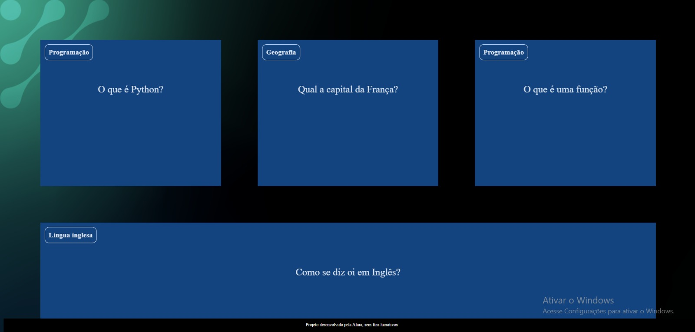
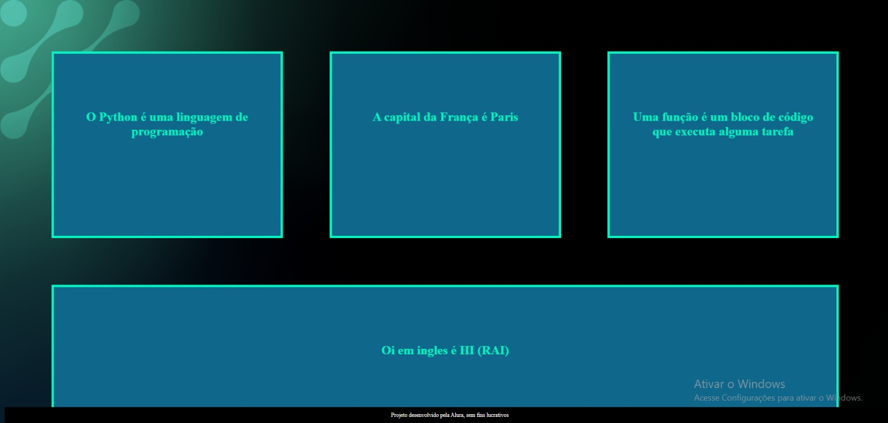

# 🧠 Flashcard JS - Projeto Educacional Interativo

📘 Projeto desenvolvido como parte de uma iniciativa da **Alura em parceria com escolas públicas**, com foco em tecnologia na educação.  
Criamos um sistema de flashcards interativos utilizando HTML, CSS e JavaScript puro.
<div></div>
<br>


## 📌 Sobre o Projeto | About the Project

O objetivo do projeto era criar uma ferramenta simples de estudo com cartões interativos que mostrassem perguntas e respostas ao clicar.  
Foi uma ótima oportunidade para aplicar conhecimentos em JavaScript e praticar lógica de exibição dinâmica de conteúdo.

---

This project was part of an initiative by **Alura in collaboration with public schools**, focused on bringing technology into education.  
We developed an interactive flashcard tool using plain HTML, CSS, and JavaScript.

<div></div> <br>

## 🛠️ Tecnologias | Technologies

- HTML5  
- CSS3  
- JavaScript (Vanilla)  
- Git & GitHub

## ✨ Funcionalidades | Features

- Cartões interativos com perguntas e respostas  
- Clique para virar o card (efeito flip)  
- Layout limpo e responsivo

---

- Interactive flashcards with questions and answers  
- Click to flip the card effect  
- Clean and responsive layout

## 🔗 Link do Projeto | Project Link

👉 [Acesse o site](https://leticiamaca.github.io/flashcard-js)

## 🚀 Como Rodar Localmente | How to Run Locally

```bash
# Clone o repositório
git clone https://github.com/leticiamaca/flashcard-js

# Acesse a pasta do projeto
cd flashcard-js

# Abra o arquivo index.html no navegador
```

## 📚 Aprendizados | What I Learned

- Manipulação de DOM com JavaScript puro  
- Criação de efeitos visuais com CSS  
- Responsividade básica e boas práticas  
- Organização de arquivos e projeto web

---

- DOM manipulation using vanilla JavaScript  
- Visual effects using CSS  
- Basic responsiveness and clean code practices  
- Web project file structure and organization

## 👩‍💻 Desenvolvido por | Developed by

**Letícia de Castro Jacob Marques**  
[GitHub Profile](https://github.com/leticiamaca)
